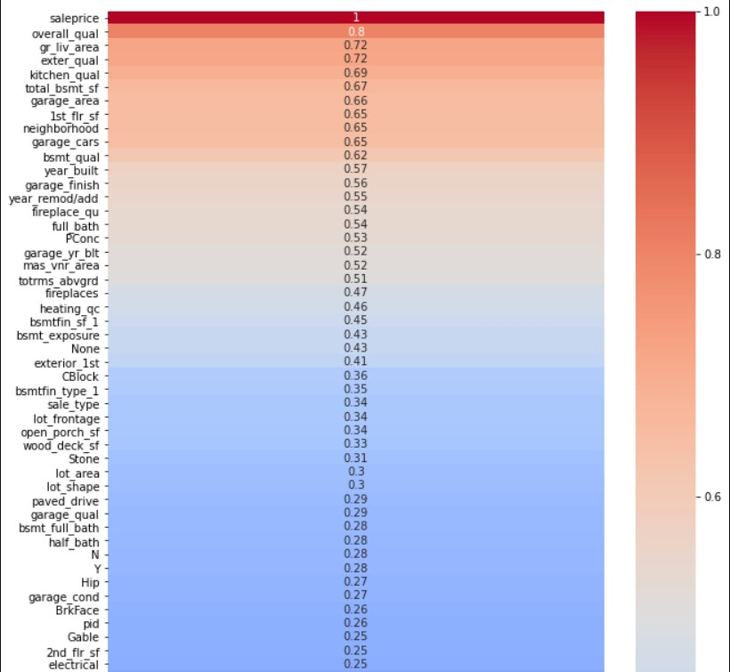
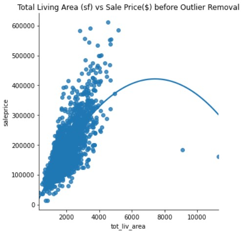
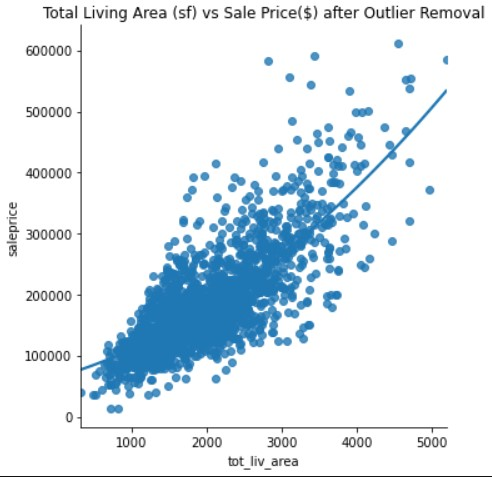

# Determining Housing Prices using Data Science
Created by : Cm April

# Background
   
   The Iowa State University and the Commerce Committee of the Iowa House of Representatives are looking into the community of Ames Iowa to understand home values in our region. The Real Estate Appraisers Coalition of Ames Iowa and I have taken on the task of creating a simplified model that will predict home values based on multiple qualities of the home. We will be looking at everything from the numbers of bedrooms and baths, locationality, quality and condition, square footage, and materials.

We have a data set containing information from the Ames Assessor’s Office used in calculating the assessed values for individual residential properties sold in Ames, IA from 2006 to 2010. The detailed description in the data documentation is here:  ([DataDoc](http://jse.amstat.org/v19n3/decock/DataDocumentation.txt))

We will be sorting through the eighty-two variables and identifying the most effective variables to include in our model. Then we will create our model and measure its accuracy.

## Problem Statement:

    Let's say: I am a data scientist working for the Real Estate Appraisers Coalition of Ames Iowa.
    We have a lot of homes in the region that need to be quickly appraised for government and educational purposes.
    We have data from the Ames Iowa Assessor’s Office used in computing values for individual residential properties 
    sold in Ames, IA from 2006 to 2010. We are going to create a model that predicts prices off home assessment 
    data entries, and in doing so we will determine what factors make the most significant impacts on the model
    to make the model more effective. Furthermore, we will test and verify these results on a competitive website for 
    data scientists (keggle) and come to an analysis on how effective the model actually is.
 

### Essentially we are asking the question:
1. What factors really matter in determining a fair market value?

    
# Brief Summary of Analysis and visualizations:
The plan of attack on cleaning this data changed numerous times through the process of analyzing the data. The data has 82 columns which include 23 nominal, 23 ordinal, 14 discrete, and 20 continuous variables. 

#### Cleaning the Ordinals:
The 23 ordinal values had a lot of null values, but 'NA' was often an option so in the interest of simplicity I assumed the assessor did not mark anything there, the home likely did not have one. This worked great for the basement, garage, fireplace, fence, pool and other quality and condition assessments with no values. 
I set up a dictionary to change the values in the data set of all the ordinal columns into ordered numerical values. NA being set at 0 and the quality and condition starting from worst at 1 and best at the maximum. 

#### Cleaning the Nominals:
For the nominal values, all null values were set to 'NA'. Then I individually domified them and checked their correlation to determine what was relevant. I'll go further into detail on this process later in this report. 

#### Cleaning the Numerical:
Most of the numerical values did not have many null values. In fact, 10 of the numerical columns only had one single null value. So not to skew the data I set the null value in each of those 10 columns to the mean of their respective columns. This may have had a small but hardly significant dampening effect on the standard deviation. This is something that as interested me for further inspection later. What should one do if there are lots of null values?

Lot Frontage is one of those cases, in which it has many null values.  I decided not to include Lot Frontage as a determining variable in my model because of these null values. Initially I measured Lot Frontage correlation to sale price as 34% with those null values as null (so not included in the calculation), and I also calculated it with setting the nulls to the mean and it only slightly changed the correlation down to 32.5%. However, setting the nulls to equal zero significantly decreased the correlation to the sale price down to 18%. Seeing that I had no actual clue why these values were null I figured best to leave it out of the model entirely, just in case.

# Exploratory Data Analysis

### Heatmap of the absolute value of all variables correlated to sale price

 To analyze the data, one of the first actions I took was to check the correlations of the numerical columns and ordered columns and take note of the columns of interest. I considered all the columns with correlation coefficients with an absolute value greater than 0.45 to be worthy of including in the model because of their strong relationship to price.  Furthermore, for simplification, I combined living area above grade with basement total square footage minus the unfinished basement area. This will give us the total living area and that seems to be one of the most important factors in making a clear and coherent model. The best fit line follows a more linear path with these elements combined.
 
 Then I went through the nominal values analyzing the domified version of each and determined if they are worth including in the model. For the nominal values I picked the 5 values that had the largest coefficients (most were lower than 0.45). 
 
Domified Variables of Importance.
|Variable|Coef Max|Coef Min|
|---|---|---|
|central_air| 0.28|-0.28|
|house_style| 0.2|-0.2|
|roof_style| 0.27|-0.25|
|mas_vnr_type| 0.31|-0.43|
|foundation| 0.53|-0.36|

 For numerical and ordinal values, I only included those with coefficients greater than 0.45. I only removed variables if I found the information redundant or repetitive. Listed below are the variables used.  
 
 Numerical and Ordinal Variables of Importance.
|Variable|Coef|Type|
|---|---|---|
|overall_qual	|0.800207| Discrete|
|tot_liv_area	|0.716558| Continuous
|exter_qual	    |0.712146| Discrete|
|kitchen_qual  	|0.692336| Discrete|
|garage_area	|0.650246| Continuous|
|bsmt_qual   	|0.612188| Discrete|
|year_remod/add	|0.550370| Discrete|
|fireplace_qu   |0.538925| Discrete|
|full_bath    	|0.537969| Discrete|
|totrms_abvgrd	|0.504014| Discrete|
|heating_qc   	|0.458354| Discrete|
  
 I compartmentalized together the 'sale_type', 'exterior_1st' and 'neighborhood' variables into 3 buckets of 'good', 'ok', and 'bad' in respect to their coefficients. This was to simplify the model and prevent an overabundance of columns created during the process. The exact cutoffs were +/- 5% for the neighborhoods, +/- 10% for the home exterior and the sale type. 
 
Bucketed Items of Importance
|Variable|Coef Max|Coef Min|
|---|---|---|
|sale_type|0.36|-0.21|
|exterior_1st|0.34|-0.19|
|neighborhood|0.45|-0.21|
 
 Finally, I removed outlines in general living area, total basement square footage and the 1st floor square footage. It was a total of 3 rows removed. As all three of these column's information is contained in total living area. The significance these 3 rows had on the best fit graph of is demonstrated below. The best fit line is set with an order of 2.

## Before and After Outliers Removed for Total Living Area vs Price.

# Setting Up a Baseline Model
 The baseline model in this example is a simple linear regression using only the top 5 variables of Overall Quality, Total Living Area, Exterior Quality, Kitchen Quality, and Garage Area. Doing a train test split on our training data, I got back a score of 84.6% on our split train, and 83.3% on our split testing data. This is not bad considering these are only 5 variables out of 80.

# Setting Up the Model
 For the model itself, I used a train test split to verify the data on itself before applying it to the new test data. I utilized polynomial features to the 2nd degree and fit the data to a standard scaler in order transform the data. 
 After attempting a few different methods, I settled on fitting the data to a ridge cross validation model. The model's r2 score indicated that the model was 93.6% fit to the training data and 87.6% accurate at determining the price in my split test set. I considered this adequate to use and decided to progress to the official testing data. 

# Conclusion/Recommendations:        
We can say with confidence that the overall quality, total living area, exterior quality, kitchen area and garage area have significant impacts on the price of the house. Going from 5 variables to 19 variables and using a more robust model we only gained 4.3% accuracy. 

I would like to dig further into methods of fitting and transforming the data. I'd like to see if we analyze more what columns should be included and what models could increase the accuracy without overfitting the data.

 

# DATA DICTIONARY:
|Feature|Type|Dataset|Description|
|---|---|---|---|  
|bad_ext|list|Train|list of exterior features with negative correlation|
|badhood|list|Train|list of neighborhoods with negative correlation|
|badhood_cor|number|neighborhood|bad hood correlation|
|dumheat|dataframe|bucketmaker|Dataframe for variables to be placed into buckets|
|dummified_TEST|dataframe|Testset|Cleaning dataframe for the test set|
|dummified_dflist|dataframe|Trainset|Cleaning dataframe for the train set|
|garagemap|array|saletype|converted ordinal string to numerical by mapping|
|good_ext|list|Train|list of exterior features with positive correlation|
|includedcolumns|list|Cleaning|Cleaning list of columns with high correlations|
|iowatest|dataframe|Test|This is our test data set|
|iowatest_clean|dataframe|Test|This is our clean test data set|
|iowatrain|dataframe|Train|This is our train data set|
|iowatrain_clean|Train|Dataset|This is our clean train data set with only the variables we are interested in modeling|
|iowatrain_full|Train|Dataset|This is our clean train data set with all the data included|
|nicehood|list|Train|list of neighborhoods with positive correlation|
|nicehood_cor|number|neighborhood|nice hood correlation|
|ok_etr|list|Train|list of exterior features with little to no correlation|
|okhood|list|Train|list of neighborhoods with little to no correlation|
|okhood_cor|number|neighborhood|nice hood correlation|
|ordinalcols|list|both|columns that have ordinal values|
|pleasedummifyme|list|both|columns that have nominal values and high corelations|
|submission|dataframe|Test|This is the submission dataframe|
|y|dataframe|Train|The sales prices from our training data|
|y_test|dataframe|Train|The sales prices from our training data|
|y_train|dataframe|Train|The sales prices from our training data|
|X|dataframe|Train|The features we are using to create out model|
|XX|dataframe|Test|The features we are using to input into the model|
|XX_poly|dataframe|Test|The features we are using to Test our model with polynomal features|
|X_overfit|dataframe|Train|The features we are using to Train our model with polynomal features|
|X_test|dataframe|Train|The features we are using to input into the model for a self check test|
|X_train|dataframe|Train|The features we are using to create out model|
|ZZ_test|dataframe|Test|The test data after transformations, ready to input in model|
|Z_test|dataframe|Train|The features we are using to create out model for a self test|
|Z_train|dataframe|Train|The features we are using to create out model after transformations|

 
# Resources

John Hazard and Prasoon Karmacharya were excellent resources in office hours. 
   
https://stackoverflow.com/questions/38913965/make-the-size-of-a-heatmap-bigger-with-seaborn
This is a link that showed me how to get my heatmap larger.

https://www.statology.org/ridge-regression-in-python/#:~:text=%20Ridge%20Regression%20in%20Python%20%28Step-by-Step%29%20%201,to%20Make%20Predictions.%20Lastly%2C%20we%20can...%20More%20
I used this website to help me figure out how to use the RidgeCV model. 

    