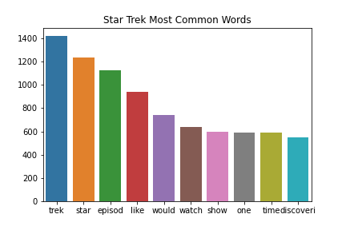
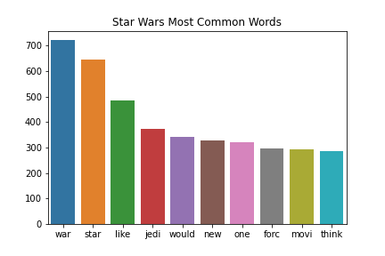
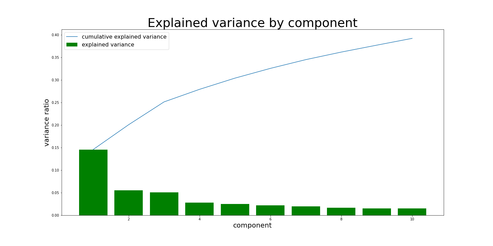
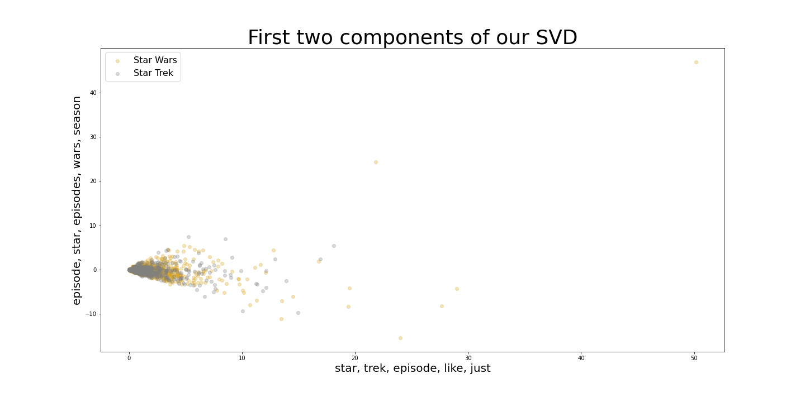
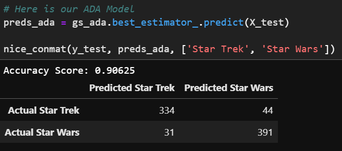
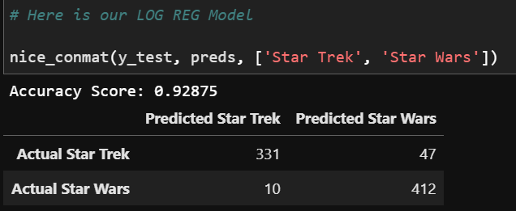
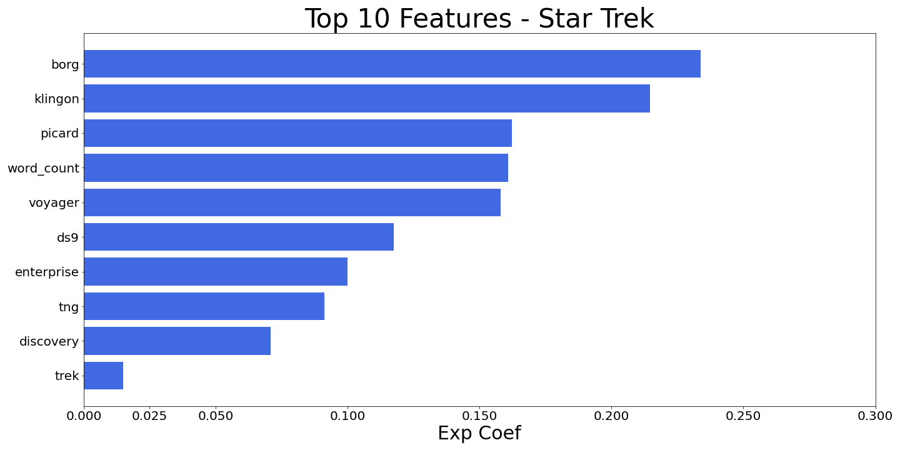

# Web API’s and NLP
Brought to you by Carl Matthew Vigil April

### Executive Summary
Hello there. My name is Cm April, nice to make your acquaintance.  In this notebook I will demonstrate how to scrape data off the web using a web application programming interface or web API. In our case we are using the [Pushshift's](https://github.com/pushshift/api) reddit API to extract submissions. In addition to this, we will use classification models and natural language processing (NLP) to determine which subreddit the language came from. This can be useful in many applications of technology that use text and/or verbal language to understand humans.  It is important to learn if you are going to explore a career in data science like I am. I hope this lesson is, as I am learning as I go, as insightful to you as it has been for me. This analysis will take the following steps to classify reddit submissions of two of my all-time favorite science fiction series.
1.	Using [Pushshift's](https://github.com/pushshift/api) API, we will collect posts from two subreddits, Star Wars and Star Trek.
2.	Then we will use NLP to train a classifier on determining which subreddit a given post came from. This is a binary classification problem.

### Problem Statement
A close friend of mine recently asked 
“What’s the difference between Star Trek and Star Wars?” 
and I nearly let me emotions get the best of me. How could someone close to me go so many years living a life without understanding what Star Wars and Star Trek are about? It hit me that there may be a lot of people out there that do not know the difference between and Vulcan and a Gungan. Horrifying! 
Well, well, well, I could not let my friend live on in darkness, so this here is a little thing I decided to do about that. For all of you reading this that have not seen Star Wars or Star Trek I mean no offence, but I highly recommend you immerse yourself in the experience sooner rather than later. I have empathy for your sad misfortune though and perhaps you do not have the time yet to watch 12 Star Wars and 13 Star Trek movies plus their respective television episodes or to dive deeper into their extended universes through books or video games. In this case I have the solution for you. My classification model here will take data from these sci-fi series subreddits and make it so that you will know if the language is about Star Trek or Star Wars. 

How can we know if someone is discussing Star Wars or Star Trek?

### Data Collection 
The data was collected using the API pushshift. Utilizing the requests library on python I collected both comments and submissions. The model is created from submissions exclusively. The comments pulled will be for further research. The parameters for web scaping are available on Pushshift API (github.com).  I used a loop graciously shown to me by Hovanes Gasparian, an instructor at General Assembly, who has provided a lot of essential insight throughout this project. The code in the web scraping notebook provided takes 20 loops through the subreddit of choice, taking 100 posts at a time, at the starting time of when you run the code and working backwards, taking a breather between cycles (to not alarm the website) before continuing the loop to completion.  This process gives us 4000 data entries of submissions, an evenly distributed 2000 entries for each subreddit.

### Data Cleaning and EDA
It is unwise to charge forward without doing some exploring of your surroundings. In the data exploration and cleaning I combined the self-text and title features, cleaned the text characters to fill in null values with an empty space and removing any special characters, and further on down the road when I found outliers I came back and here to remove them. I tokenized, lemmatized and stemmed out the words, considering stop words as well to explore the data in depth and even did a word frequency check that indicates the most common words in each subreddit. However this is a lot of overlap in these simmilar subreddits so we will have to see which are important fror the model after we evaluate it.

I checked for outliners in the extremes of word length and from count vectorizing my text data. Fortunately, there was not many although that may be different depending on when you scrape more data. After these items are completed and that data looks good and we may proceed to the model. 

### Feature Engineering 
Important features such as word count and a sentiment intensity analyzer are calculated and added to the data frame to include in the models. A function transformer is set to create the columns we care about for the model. Text data is set to the ‘all’ column which is a cleaned and combined version of self-text and title. Our numerical data is our recently calculated word count and sentiment. 

### Model Selection 
I tested on two models, an adaboost and a logistic regression classifier model and ran them through a cross validated grid search. The adaboost was the least over/under fit model however the logistic region performed at a higher accuracy level so I selected it. 

### Evaluation and Conclusion

In conclusion for those of you that have not seen or heard of Star Wars or Star Trek you could memorize what category these 20 words are in and have a solid idea of which fandom your friend is talking about. This model evaluates textual data to identify what people are discussing in two distinct but similar categories. If you are like me and aspiring to learn more about data science, you should find this quite fascinating. The fact we can teach a computer to interpret a common theme from human language has far reaching potential. Most people do not get the opportunity to explore this type of knowledge and I am excited to be on this journey with you. 

### Credits

I have to give major shout outs to my peers and mentors at General Assembly. Charlie Rice, John Hazzard, and Hovanes Gasperian all helped me grasp and understand NLP. Their experience and guidance made this possible. James Opacich, Kira Helm, Emily Naftan, Heather Johnansen, Jessie Tao, and more provided excellent advice when in the fold and they provided support and know how when discussing coding issues all whilst they are also on their data science adventures. Thank You! 

